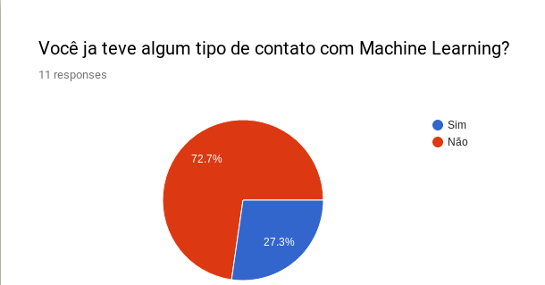
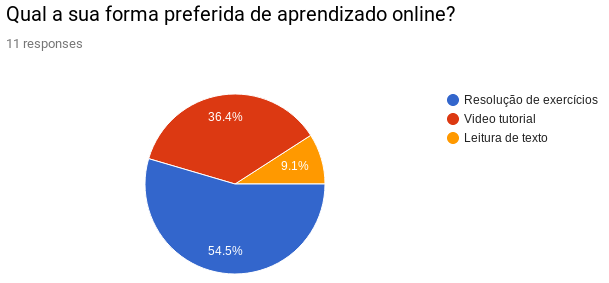
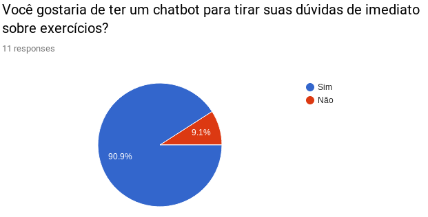
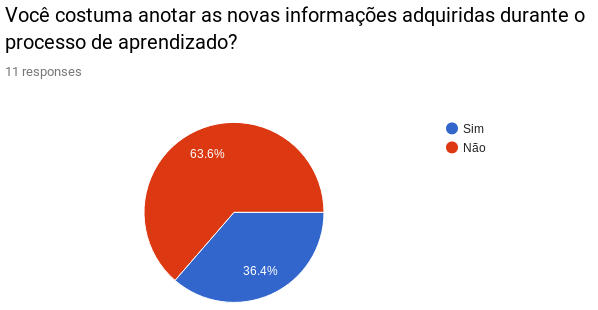

## Histórico de Revisão

|    Data    | Versão |	   Alteração    |      Autor     |
|:----------:|:------:|:---------------:|:--------------:|
| 25/04/2019 |  1.0   | Criação do documento |Carlos Aragon|

# Requisitos
Os requisitos do projeto foram elicitados com base nas demanda solicitada pela matéria de EPS.
Utilizando as técnicas de brainstorming e questionário foi construído um [backlog](Backlog.md).

# Brainstorming
Esta técnica foi utilizada devido ao contexto do bot. Por ser um bot de ensino a respeito do tema de machine learning, tema de domínio por parte do grupo de EPS, foi escolhido uma lista de temas e subtemas aos quais os membros tiveram maior grau de dificuldade no processo de aprendizagem do tópico machine learning. Os temas e subtemas fdefinidos foram:

* Pré-processamento de dados
    - Importação de dados [(Pandas)](https://pandas.pydata.org/)
    - Tratamento de dados [(Pandas)](https://pandas.pydata.org/), [(SciKit Learn)](https://scikit-learn.org/stable/modules/preprocessing.html)
* Modelagem
    - Aprendizado supervisionado [(SciKit Learn)](https://scikit-learn.org/stable/modules/preprocessing.html)
    - Aprendizado não-supervisionado [(SciKit Learn)](https://scikit-learn.org/stable/modules/preprocessing.html)
* Visualização
    - Visualização de dados [(Matplotlib)](https://matplotlib.org/), [(Seaborn)](https://seaborn.pydata.org/)
    - Visualização de resultados [(SciKit Learn)](https://scikit-learn.org/stable/modules/preprocessing.html)
* Tutorial
    - Iris Flower [(SciKit Learn)](https://scikit-learn.org/stable/modules/preprocessing.html)
    - MNIST [(SciKit Learn)](https://scikit-learn.org/stable/modules/preprocessing.html)
    - Titanic [(SciKit Learn)](https://scikit-learn.org/stable/modules/preprocessing.html)
* Sugestões de conteúdo
    - Espaços de conteúdos [(Medium)](https://medium.com/), [(TowardsDataScience)](https://towardsdatascience.com/), [(Kaggle)](https://kaggle.com)
    - Fórum [(Cross Validated)](https://stats.stackexchange.com/), [(Artificial Intelligence StackExchange)](https://ai.stackexchange.com/)

# Questionario
O questionário foi desenvolvido buscando validar algumas funcionalidades propostas pelo grupo. Devido ao baixo número de respostas o questionário não foi utilizado como fator primário de validação, servindo de apoio a introspecção dos membros de MDS que para a confecção do projeto passam pelo processo de aprender ml, alertando assim sobre as áreas críticas de seu aprendizado.

