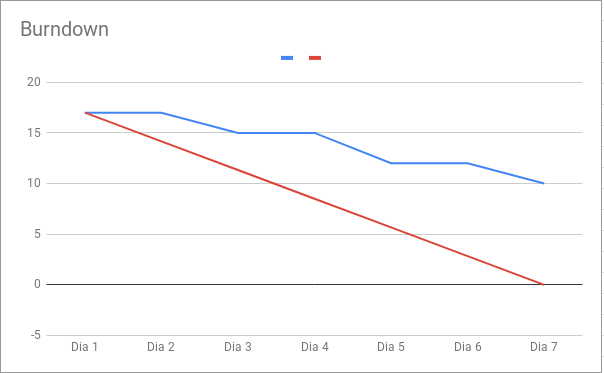
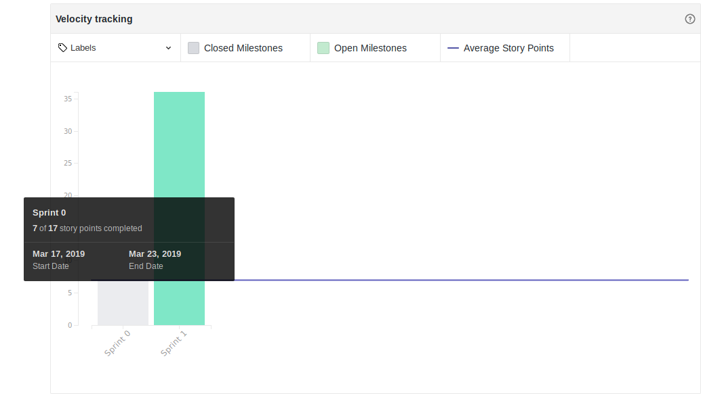

## Version control

|Date|Version|Update|Author|
|:--:|:----:|:-------:|:---:|
|24/03/2019|0.1|Sprint Review|Thiago Ferreira|

# Sprint 0

## Resumo da Sprint
Esta sprint teve como marco a definição da temática do projeto, criação de documentação de base e treinamentos de nivelamento para a equipe de desenvolvimento. Também foram fechadas issues focadas na adequação do repositório aos padrões de comunidade recomendados do github. 
Quantos as pendências, ficaram pendentes duas issues de treinamentos relativas à tópicos mais avançados, estas issues correspondendo à 10 pontos em total e acabando por prejudicar o burndown dessa sprint inicial.
___
## Fechamento da Sprint

|Issue|Status|Pontos|
|:--:|:----:|:-------:|
|Come up with a name for the project| Concluída |0|
|Attend to SCRUM framework training|Concluída|2|
|Decide which topic the bot will help with|Concluída|1|
|Attend Git Training|Concluída|2|
|Create commit policy document|Concluída|1|
|Create branch policy document|Concluída|1|
|Learn about chatbot|Não Concluida|5|
|Learn about Microservices Arquitecture|Não Concluida|5|
___

## Sprint Burndown

## Sprint Velocity

## Sprint Review

### Positivo
    * Bons Treinamentos

### Negativo
    * Comunicação entre o membros
    * Engajamento Github
    * Noção de Papéis

### A Melhorar
    * Organização de reunião
    * Divulgar pauta reunião anteriormente
    * Preparação
    * Melhor entedimento dos papéis dos membros
    
## Equipe
**Equipe de Gerência:**  
* **Arquiteto:** [Davi Alves](https://github.com/davialvb)   
* **DevOps:** [Gabriel Ziegler](https://github.com/gabrielziegler3)  
* **Product Owner:** [Carlos Aragon](https://github.com/carlosaragon)  
* **Tech Leader:** [Thiago Ferreira](https://github.com/thiagoiferreira)

**Equipe de Desenvolvimento:**  
- [Alex Porto](https://github.com/alexportof) 
- [Bruno Duarte](https://github.com/Mexazonic) 
- [Ernando Braga](https://github.com/ZarathosDeath) 
- [Eugenio Sales](https://github.com/Eugeniosales) 
- [João Victor](https://github.com/joao15victor08) 