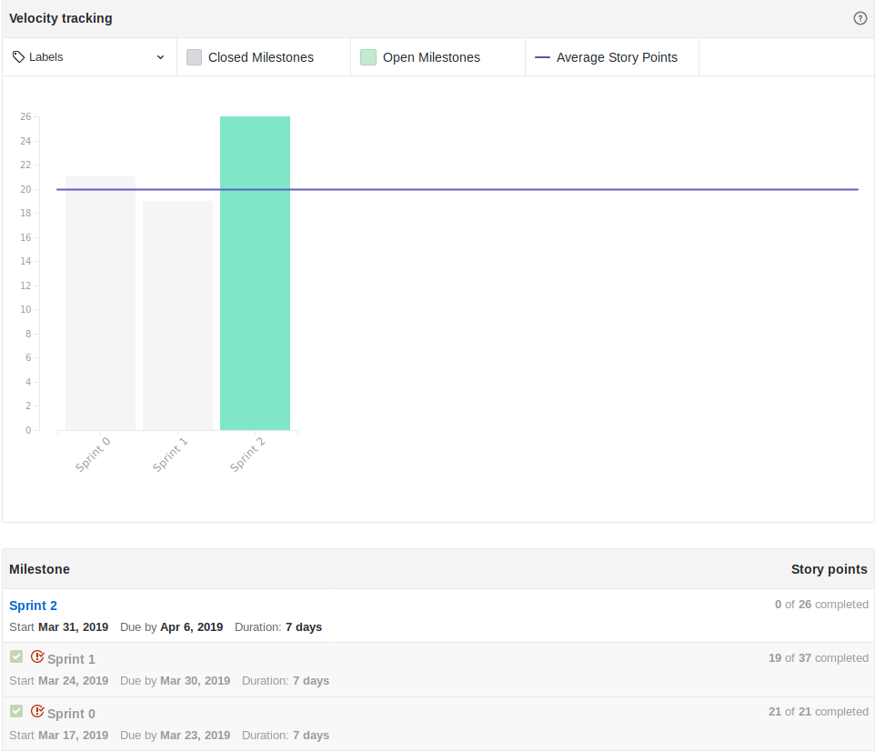

## Version control

|Date|Version|Update|Author|
|:--:|:----:|:-------:|:---:|
|29/03/2019|0.1|Sprint Review preparation|Thiago Ferreira|
|02/03/2019|0.2|Changes to SM avaliation|Thiago Ferreira|

# Fechamento da Sprint

|Issue|Pontos|Status|
|:--:|:-------:|:--:|
|Elaborar EAP|5|Pendente|
|Elaborar TAP|5|Pendente|
|Levantar Requisitos|3|Pendente|
|Treinamento de Python|2|Entregue|
|Iniciar Documento de Visão|5|Entregue|
|Levantamento de Riscos|3|Entregue|
|Roadmap do Projeto|5|Pendente|
|Estudo de Docker|3|Entregue|
|Fazer gitflow|2|Entregue|
|Treinamento de Git 2|2|Entregue|
|Dockerize the Application|5|Descontinuada|
#### Débitos
|Issue|Pontos|Status|
|:--:|:-------:|:--:|
|Learn about Microservices Arquitecture|Entregue*|5|
|Learn about chatbot|Entregue*|5|

**Pontos Planejados:** 50
**Pontos Concluídos:** 32
___

# Burndown

# Velocity

# Retrospectiva

## Presença Dailies Presenciais

| Nome    |Segunda Feira      | Terça Feira      | Quarta Feira     | Quinta Feira      | Sexta Feira      |     
|:-----:  |:-----------------:|:----------------:|:----------------:|:-----------------:|:----------------:|
|Alex     |         ✘         |         ✘        |         ✘        |         ✔         |         ✔        |
|Bruno    |         ✘         |         ✔        |         ✔        |         ✔         |         ✔        |
|Eugênio  |         ✔         |         ✘        |         ✔        |         ✔         |         ✔        |
|Ernando  |         ✔         |         ✔        |         ✔        |         ✔         |         ✔        |
|João Victor|         ✔         |         ✔        |         ✔        |         ✔         |         ✔        |
|Carlos   |         ✘         |         ✘        |         ✘        |         ✘         |         ✔        |
|Davi     |         ✘         |         ✔        |         ✔        |         ✘         |         ✔        |
|Ziegler  |         ✘         |         ✔        |         ✘        |         ✘         |         ✘        |
|Thiago   |         ✔         |         ✔        |         ✔        |         ✘         |         ✔        |

O membro da equipe Alex Porto apresentou para terça-feira e quarta-feira um atestado médico, justificando assim, suas ausências nos respectivos dias. Na tabela não foram consideradas as presenças de daily no Slack, onde se considerada, todos os membros participaram de todas as dailies.

## Avaliação do Scrum Master
Tivemos uma sprint razoavelmente produtiva, entretanto a equipe acabou por não ser ágil, entregamos uma quantidade considerável de pontos mesmo assim. Na próxima sprint buscaremos atacar esse problema enfrentado com algumas táticas que serão implementadas e detalhadas durante a próxima sprint. Houve entretanto uma evolução considerável na comunicação e também outros tópicos por parte dos membros.

Apesar da sprint produtiva, houve caso do PO Carlos Aragon que não entregou nenhuma issue/documento individual e que acaba por afetar o andamento do projeto em alguns casos. Para a próxima sprint, esse risco que já foi levantado na documentação de riscos, será acompanhado de perto e terá uma cobrança mais rígida em sentido da finalização das pendências e progressão das issues planejadas.
