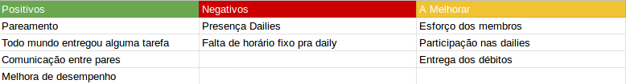

## Version control

|Date|Version|Update|Author|
|:--:|:----:|:-------:|:---:|
| 07/05/2019 |0.1|Criação e desenvolvimento do documento|Thiago Ferreira|

# Fechamento da Sprint

## Sprint Backlog

### Issues

|Issue|Pontos|Responsável|Status|
|:---:|:----:|:---------:|:--------:|
|Arrumar front-end de maneira responsiva|0|Thiago e Ernando|Não Entregue|
|Arrumar gráficos de burndown|0|Carlos Aragon|Não Entregue|
|Migrar serviço de CI|0|Gabriel Ziegler|Entregue|
|Arrumar docker na devel|0|Gabriel Ziegler|Entregue|
|Subir registros dos serviços utilizados|0|Gabriel Ziegler|Entregue|
| DEB - US22 - Integração ao Kaggle| 5 | Ernando e Bruno|Não Entregue|
| DEB - US22 - Integração ao TowardsDataScience/Medium | 5 |Bruno e Carlos|Não Entregue|
| DEB - Deploy dos micro serviços em AWS | 8 | Ziegler |Não Entregue|
| DEB - Integrar API StackOverflow | 5 | Carlos Aragon & Ernando |Não Entregue|
| DEB - Testes de Usabilidade e UX na aplicação|5|Davi e Eugenio|Não Entregue|

**Pontos Planejados:** 28  
**Pontos Concluídos:** 0  
**Pontos Concluidos com debito: 0**

### Legenda

- DEB: Débito de sprint passada.

### MVPs da Sprint

<table>
  </tr>
  <td align="center">
    <a href="https://github.com/Mexazonic">
       <b>Bruno Duarte</b></a> <a href="https://github.com/fga-eps-mds/2019.1-PyLearner/commits?author=Mexazonic" title="MVP">📖
    </a>
  </td>
  <td align="center">
    <a href="https://github.com/gabrielziegler3">
       <b>Gabriel Ziegler</b></a> <a href="https://github.com/fga-eps-mds/2019.1-PyLearner/commits?author=gabrielziegler3" title="MVP">📖
    </a>
  </td>
  <td align="center"><a href="https://github.com/zarathosdeath"> <b>Ernando </b></a> <a href="https://github.com/fga-eps-mds/2019.1-PyLearner/commits?author=zarathosdeath" title="Documentation">📖</a>
  </td>
  <tr>
  
</table>

# Burndown

A Sprint 12 não teve nenhum ponto efetivo diretamente associada a ela e desta forma, não teve gráfico de burndown.

# Velocity

- Análise:

# Retrospectiva

## Presença na Reunião

* <b>Bruno      </b> : Presente
* <b>Eugênio    </b> : Presente
* <b>Ernando    </b> : Presente
* <b>João Victor</b> : Não Presente
* <b>Carlos     </b> : Presente
* <b>Davi       </b> : Presente
* <b>Ziegler    </b> : Presente
* <b>Thiago     </b> : Presente
* <b>Total      </b> : Presente

O membro João Victor, de MDS, não pode comparecer a reunião pelo motivo de estar com dengue.

# Equipe
**Equipe de Gerência:**  
* **Arquiteto:** [Davi Alves](https://github.com/davialvb)   
* **Tech Leader:** [Gabriel Ziegler](https://github.com/gabrielziegler3)  
* **Product Owner:** [Carlos Aragon](https://github.com/carlosaragon)  
* **Devops:** [Thiago Ferreira](https://github.com/thiagoiferreira)

**Equipe de Desenvolvimento:**  
- [Bruno Duarte](https://github.com/Mexazonic) 
- [Ernando Braga](https://github.com/ZarathosDeath) 
- [Eugenio Sales](https://github.com/Eugeniosales) 
- [João Victor](https://github.com/joao15victor08) 