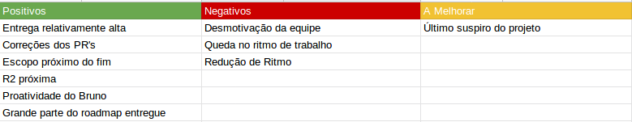

## Version control

|Date|Version|Update|Author|
|:--:|:----:|:-------:|:---:|
| 07/05/2019 |0.1|Criação e desenvolvimento do documento|Thiago Ferreira|

# Fechamento da Sprint

## Sprint Backlog

### Issues
|Issue|Pontos|Responsável|
|:---:|:----:|:---------:|
|Adicionar dependências dos tutoriais|Gabriel Ziegler|1|Não Entregue|
|Implementar scroll automático nas respostas do bot|Ernando|2|Não Entregue|
|Refatorar intent matplotlib|João|0|Entregue|
|Adicionar fluxo de guia para um iniciante|Eugenio Sales|2|Entregue|
|Refatorar intent de despedida do bot|Bruno|2|Entregue|
|Refatorar maneira que bot responde suas ações|Bruno|1|Entregue|
| DEB - US22 - Integração ao Kaggle| 5 | Ernando e Bruno|Não Entregue|
| DEB - US22 - Integração ao TowardsDataScience/Medium | 5 |Bruno e Carlos|Entregue|
| DEB - Deploy dos micro serviços em AWS | 8 | Ziegler |Não Entregue|
| DEB - Integrar API StackOverflow | 5 | Carlos Aragon & Ernando |Entregue|
| DEB - Testes de Usabilidade e UX na aplicação|5|Davi e Eugenio|Entregue|
| DEB - Arrumar front-end de maneira responsiva|0|Thiago e Ernando|Não Entregue|
| DEB - Arrumar gráficos de burndown|0|Carlos Aragon|Não Entregue|

**Pontos Planejados:** 36  
**Pontos Concluídos:** 20  

### Legenda

- DEB: Débito de sprint passada.

### MVPs da Sprint

<table>
  </tr>
  <td align="center">
    <a href="https://github.com/Mexazonic">
       <b>Bruno Duarte</b></a> <a href="https://github.com/fga-eps-mds/2019.1-PyLearner/commits?author=Mexazonic" title="MVP">📖
    </a>
  </td>
  <td align="center">
    <a href="https://github.com/ZarathosDeath">
       <b>Ernando Braga</b></a> <a href="https://github.com/fga-eps-mds/2019.1-PyLearner/commits?author=ZarathosDeath" title="MVP">📖
    </a>
  </td>
  <td align="center"><a href="https://github.com/EugenioSales"> <b>Eugenio Sales </b></a> <a href="https://github.com/fga-eps-mds/2019.1-PyLearner/commits?author=Eugeniosales" title="Documentation">📖</a>
  </td>
  <tr>
  
</table>

# Burndown

# Velocity

- Análise: 
# Retrospectiva

## Presença na Reunião

* <b>Bruno      </b> : presente
* <b>Eugênio    </b> : presente
* <b>Ernando    </b> : presente
* <b>João Victor</b> : não presente
* <b>Carlos     </b> : presente
* <b>Davi       </b> : presente
* <b>Ziegler    </b> : presente
* <b>Thiago     </b> : presente
* <b>Total      </b> : presente

O membro de MDS, João Victor, não compareceu a reunião da sprint por motivos de saúde.

# Equipe
**Equipe de Gerência:**  
* **Arquiteto:** [Davi Alves](https://github.com/davialvb)   
* **Tech Leader:** [Gabriel Ziegler](https://github.com/gabrielziegler3)  
* **Product Owner:** [Carlos Aragon](https://github.com/carlosaragon)  
* **Devops:** [Thiago Ferreira](https://github.com/thiagoiferreira)

**Equipe de Desenvolvimento:**  
- [Bruno Duarte](https://github.com/Mexazonic) 
- [Ernando Braga](https://github.com/ZarathosDeath) 
- [Eugenio Sales](https://github.com/Eugeniosales) 
- [João Victor](https://github.com/joao15victor08) 