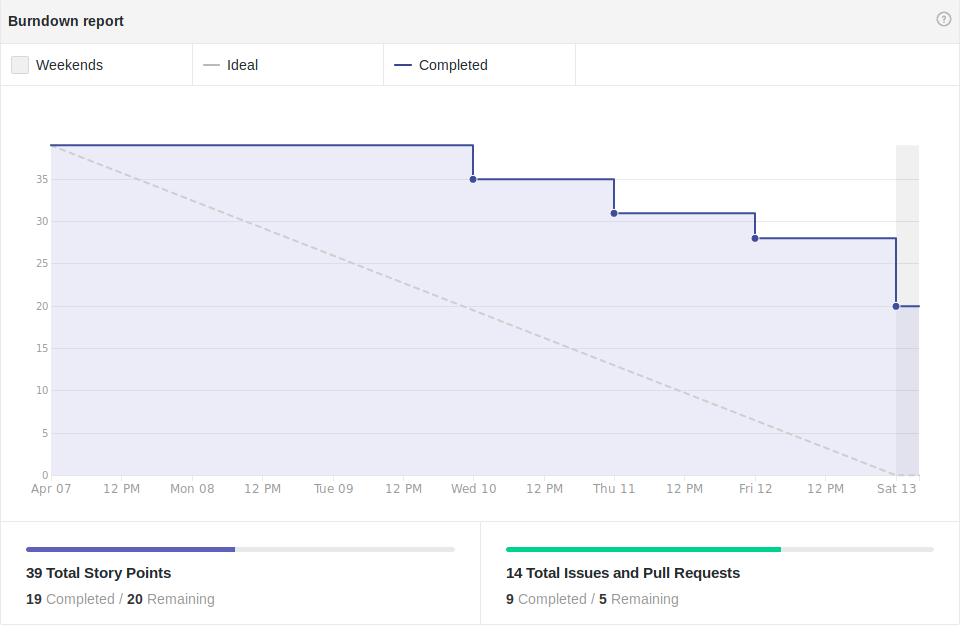

## Version control

|Date|Version|Update|Author|
|:--:|:----:|:-------:|:---:|
|13/04/2019|0.1|Sprint Review preparation|Thiago Ferreira|
|14/04/2019|0.2|Sprint Review Refining|Thiago Ferreira|

# Fechamento da Sprint

## Issues
|Issue|Pontos|Responsável|Status|
|:--:|:-------:|:--:|:---:|
|Criar Organização do Projeto|0|Scrum Master|Entregue|
|Cirar Ambiente docker para Jupyter|2|DevOps|Entregue|
|Cirar Ambiente docker para Rocketchat|3|DevOps|Entregue|
|Cirar Ambiente docker para MongoDB|2|DevOps|Entregue|
|Treinamento RASA|2|Arquiteto|Entregue|
|TS-22 - Preparar dados de Treino|5|Bruno, Alex e Eugenio|Entregue|
|TS-23 - Visualizar dados de treino|3|Bruno, Alex e Eugenio|Não Entregue|
|Protótipo de Alta Fidelidade|8|Ernando e João Victor|Não Entregue|
|Criar uma identidade visual para a aplicação|1|Eugênio|Entregue|

### Débitos
|Issue|Pontos|Responsável|Status|
|:--:|:-------:|:--:|:---:|
|Roadmap do Projeto|5|Tech Lead e Product Owner|Não Entregue|
|Aplicar Questionário ao Público|2|Product Owner|Entregue|
|Processar informações obtidas através da aplicação do questionário|2|Product Owner|Não Entregue|
|Roadmap Individual Arquiteto|1|Arquiteto|Entregue|
|Desenvolver Documento de Metodologia|3|Tech Lead|Entregue|
___
**Pontos Planejados:** 39  
**Pontos Concluídos:** 19
___

# Burndown

# Velocity

# Retrospectiva

## Presença na Reunião
**EPS:** 
* [Davi Alves](https://github.com/davialvb)  
* [Gabriel Ziegler](https://github.com/gabrielziegler3)
* [Thiago Ferreira](https://github.com/thiagoiferreira)

**MDS:** 
- [Alex Porto](https://github.com/alexportof)
- [Bruno Duarte](https://github.com/Mexazonic)
- [Ernando Braga](https://github.com/ZarathosDeath)
- [Eugenio Sales](https://github.com/Eugeniosales)

### Observações
* O membro da equipe, Ernando foi embora antes do término da reunião, mais precisamente às 15:00.
* João Victor não compareceu a reunião devido a enfermidade.
* Carlos Aragon não compareceu a reunião.

## Presença Dailies Presenciais

| Nome    |Segunda Feira      | Terça Feira      | Quarta Feira     | Quinta Feira      | Sexta Feira      |     
|:-----:  |:-----------------:|:----------------:|:----------------:|:-----------------:|:----------------:|
|Alex     |         ✔         |         ✘        |         ✔        |         ✘         |         ✘        |
|Bruno    |         ✔         |         ✔        |         ✔        |         ✔         |         ✘        |
|Eugênio  |         ✔         |         ✔        |         ✘        |         ✔         |         ✘        |
|Ernando  |         ✔         |         ✔        |         ✘        |         ✔         |         ✘        |
|João Victor|         ✔         |         ✘        |         ✔        |         ✔         |         ✘        |
|Carlos   |         ✘         |         ✔        |         ✔        |         ✘         |         ✘        |
|Davi     |         ✔         |         ✔        |         ✔        |         ✔         |         ✘        |
|Ziegler  |         ✔         |         ✘        |         ✔        |         ✔         |         ✘        |
|Thiago   |         ✔         |         ✔        |         ✘        |         ✘         |         ✘        |

## Avaliação da Sprint
Essa sprint foi marcada pelo início do desenvolvimento por parte da equipe. As issues levantadas em histórias de usuário ficaram dependenetes do PO para especificação, este subindo as issues apenas na quarta-feira e mesmo assim, de forma nada clara. O PO também fez questão, de nessa sprint, não comparecer a reunião de planejamento nem preparar nada para ser repassado para a equipe, comprovando o nível de risco determinado no documento de riscos, que seria o mesmo e também o impacto que isso teria na equipe, principalmente nesta fase inicial de desenvolvimento onde o PO é fundamental para um bom encaminhamento do projeto. A equipe discutiu essas ocorrências e providências cabíveis serão analisadas e tomadas durante esta semana.

Apesar das inconveniências da sprint, também marcadas por uma ausência de dockerização adequada, onde os membros responsáveis pelo protótipo foram procurar ajudar por parte do devOps, para que o protótipo em javascript com o chatbot integrado ao Jupyter fosse feita a equipe surpreendeu, principalmente na parte do Eugênio e do Bruno que conseguiram entregar a issue de preparamento dos dados de treino. 

Ao fechamento da sprint, pode-se notar uma diferença de dedicação bem discrepante entre os membros, alguns tomando bem mais iniciativas que os demais. A gerência tentará trabalhar nisso essa semana para que alguns membros não fiquem desmotivados. Também será dada mais independência aos membros e maior espeficicação das tarefas em questão. Entretanto, apesar desses "problemas", houve feedback positivo por parte da equipe quanto ao apoio que está sendo dado a eles, principalmente quando esses mostraram proatividade no desenvolvimento das tarefas repassadas durante essa sprint.

Tentaremos durante a próximo sprint trabalhar também no preenchimento de planilhas, fazendo uma cobrança diária no grupo e também lembrar os membros das dailies, que acabou tendo faltas em excesso durante essa sprint.

## Equipe
**Equipe de Gerência:** 
* **Arquiteto:** [Davi Alves](https://github.com/davialvb)  
* **DevOps:** [Gabriel Ziegler](https://github.com/gabrielziegler3)  
* **Product Owner:** [Carlos Aragon](https://github.com/carlosaragon)  
* **Tech Leader:** [Thiago Ferreira](https://github.com/thiagoiferreira)

**Equipe de Desenvolvimento:** 
- [Alex Porto](https://github.com/alexportof)
- [Bruno Duarte](https://github.com/Mexazonic)
- [Ernando Braga](https://github.com/ZarathosDeath)
- [Eugenio Sales](https://github.com/Eugeniosales)
- [João Victor](https://github.com/joao15victor08)
