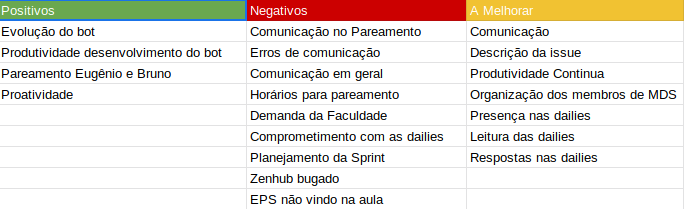

## Version control

|Date|Version|Update|Author|
|:--:|:----:|:-------:|:---:|
|26/04/2019|0.1|Sprint Review structure|Thiago Ferreira|
|27/04/2019|0.2|Detalhamento da sprint|Thiago Ferreira|

# Fechamento da Sprint

## Issues
|Issue|Pontos|Responsável|Status|
|:--:|:-------:|:--:|:---:|
|Task TS01 - Testar fluxos de conversação|3|Davi, Bruno e Eugênio|Entregue|
|Task TS01 - Treinamento do bot|2|Davi, Bruno e Eugênio|Entregue|
|US19 - Eu como usuário	desejo ver um tutorial com várias técnicas para conseguir criar um classificador usando machine learning |5|Ernando e Alex e João Victor |Não Entregue|
|Adição de dados para melhoria do bot|3|Eugênio e Bruno||
|Adicionar referências no TAP|1|Carlos|Entregue|
|Adicionar informações no README|1|Ziegler|Entregue|
|Reorganição EAP|1|Carlos|Entregue|
|Integração Contínua do projeto com o docker|2|Ziegler|Entregue|
|Refatoração dos dados para treinamento do bot|2|Eugênio e Bruno|Entregue|

### Débitos
|Issue|Pontos|Responsável|Status|
|:--:|:-------:|:--:|:---:|
|Roadmap do Projeto|5|Tech Lead e Product Owner| Entregue |
|Protótipo de Alta Fidelidade|3|Ernando e João Victor| Não Entregue |
|Levantar Requisitos do Projeto|3|Equipe EPS| Entregue |

___
**Pontos Planejados:** 31  
**Pontos Concluídos:** 28
___

# Burndown

# Velocity

# Retrospectiva

## Presença na Reunião
**EPS:** 
* [Davi Alves](https://github.com/davialvb)  
* [Carlos Aragon](https://github.com/carlosaragon)
* [Thiago Ferreira](https://github.com/thiagoiferreira)

**MDS:** 
- [Alex Porto](https://github.com/alexportof)
- [Ernando Braga](https://github.com/ZarathosDeath)
- [Eugenio Sales](https://github.com/Eugeniosales)
- [João Victor](https://github.com/joao15victor08)

### Observações
Os membros Bruno Duarte e Gabriel Ziegler não compareceram à reunião, o segundo sendo por motivo de viagem.

## Presença Dailies Presenciais

| Nome    |Segunda Feira      | Terça Feira      | Quarta Feira     | Quinta Feira      | Sexta Feira      |     
|:-----:  |:-----------------:|:----------------:|:----------------:|:-----------------:|:----------------:|
|Alex     |          ✘        |         ✔        |         ✔        |         ✔         |         ✔        |
|Bruno    |          ✔        |         ✔        |         ✔        |        ✔          |         ✔        |
|Eugênio  |          ✔        |         ✔        |         ✘        |         ✔         |         ✔        |
|Ernando  |         ✔         |         ✔        |         ✔        |         ✔         |         ✘        |
|João Victor|       ✘         |         ✔        |         ✔        |        ✔          |          ✘       |
|Carlos   |          ✘        |         ✔        |         ✔        |         ✘         |         ✘        |
|Davi     |          ✘        |         ✔        |         ✔        |         ✔         |         ✔        |
|Ziegler  |         ✔         |         ✔        |         ✘        |         ✔         |         ✔        |
|Thiago   |         ✔         |         ✔        |         ✔        |         ✔         |         ✔        |

## Avaliação da Sprint
Essa sprint foi uma sprint de otimização, tendo uma pegada mais estável com relação as anteriores, em que foram desenvolvidas funcionalidades.
Essa sprint foi marcada por falhas de comunicação dentro dos pareamentos, dinâmica que os membros não haviam desempenhado na última semana e acabaram por estarem desacostumados com a questão, ao longo da sprint conforme cobrança, acredita-se que houve certa melhoria mas todavia, a comunicação ficou aquem do esperado e do necessário.
Outro problema encontrado pela equipe foi um erro no docker do jupyter notebook. O problema impossibilitava a manutenção de arquivos e a equipe teve de usar outros artifícios para conseguir finalizar as tarefas, esse problema acarretou no atraso de algumas tarefas, que acabaram sendo perdidas, na próxima sprint uma issue de correção destes bugs será criada.
Essa sprint, em contraponto as anteriores, tivemos um maior engajamento da equipe de gerência em geral, todos mantendo um desempenho aceitável e reduzindo os problemas esperados, tentaremos manter esse desempenho.
Outro ponto a ser tocado é a questão de conseguimos entregar todas as issues de débito em documentação, essas que haviam sido negligênciadas por um tempo pela equipe e agora estão prontas.

# Equipe
**Equipe de Gerência:**  
* **Arquiteto:** [Davi Alves](https://github.com/davialvb)   
* **DevOps:** [Gabriel Ziegler](https://github.com/gabrielziegler3)  
* **Product Owner:** [Carlos Aragon](https://github.com/carlosaragon)  
* **Tech Leader:** [Thiago Ferreira](https://github.com/thiagoiferreira)

**Equipe de Desenvolvimento:**  
- [Alex Porto](https://github.com/alexportof) 
- [Bruno Duarte](https://github.com/Mexazonic) 
- [Ernando Braga](https://github.com/ZarathosDeath) 
- [Eugenio Sales](https://github.com/Eugeniosales) 
- [João Victor](https://github.com/joao15victor08) 