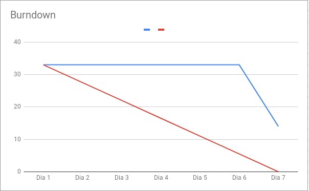
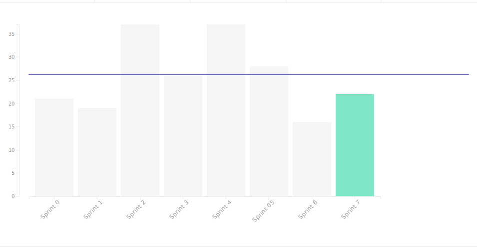
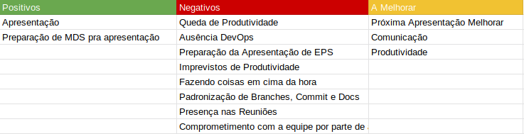

## Version control

|Date|Version|Update|Author|
|:--:|:----:|:-------:|:---:|
|04/05/2019|0.1|Sprint Review|Thiago Ferreira|

# Fechamento da Sprint

## Issues
|Issue|Pontos|Responsável|Status|
|:--:|:-------:|:--:|:---:|
|US03 - Eu como usuário desejo saber como importar dados de um excel|1|Alex|Entregue|
|US05 - Eu como usuário desejo saber como transformar dados categóricos|3|Bruno |Entregue|
|US08 - Eu como usuário desejo saber quais modelos usar para classificação|8|Eugenio e João|Não Entregue|
|US16 - Eu como usuário desejo saber como visualizar um relatório de classificação|2|Alex|Entregue|
|US17 - Eu como usuário desejo saber como visualizar uma matriz de confusão|3|Eugenio|Não Entregue|
|US20 - Tutorial de Machine Learning do Problema MINIST|3|João Victor|Entregue|
|US21 - Tutorial de Machine Learning do Problema do Titanic|3|Ernando|Não Entregue|
|Preparar apresentação Release 1|5|Equipe|Entregue|
|Criação de um Plano de medição|5|Carlos Aragon|Não Entregue|
|Bug Docker do Jupyter|2|Davi e Carlos|Não Entregue|
|Refatoração de Intents, Acations e Stories|2|Bruno, Eugenio e Davi|Entregue|

### Débitos
|Issue|Pontos|Responsável|Status|
|:--:|:-------:|:--:|:---:|
|Protótipo de Alta Fidelidade|3|Ernando e João Victor|Entregue|

___
**Pontos Planejados:** 19  
**Pontos Concluídos:** 38
___

# Burndown

# Velocity

# Retrospectiva

## Presença na Reunião
**EPS:** 
* [Davi Alves](https://github.com/davialvb)
* [Gabriel Ziegler](https://github.com/gabrielziegler3)
* [Carlos Aragon](https://github.com/carlosaragon)
* [Thiago Ferreira](https://github.com/thiagoiferreira)

**MDS:** 
- [Alex Porto](https://github.com/alexportof)
- [Ernando Braga](https://github.com/ZarathosDeath)
- [Eugenio Sales](https://github.com/Eugeniosales)
- [Bruno Duarte](https://github.com/Mexazonic)

### Observações
O membro João Victor não compareceu a reunião, por motivos desconhecidos.

## Presença Dailies Presenciais

| Nome    |Segunda Feira|Terça Feira|Quarta Feira| Quinta Feira| Sexta Feira|
|:-----:  |:-----------------:|:----------------:|:----------------:|:-----------------:|:----------------:|
|Alex     |✔|✔|✘|✔|✘|
|Bruno    |✘|✔|✔|✔|✘|
|Eugênio  |✔|✔|✔|✔|✔|
|Ernando  |✔|✔|✘|✔|✘|
|João Victor|✘|✔|✘|✔|✘|
|Carlos   |✔|✔|✘|✔|✔|
|Davi     |✔|✔|✔|✔|✔|
|Ziegler  |✘|✔|✘|✔|✘|
|Thiago   |✘|✔|✘|✔|✘|

## Avaliação da Sprint
Essa sprint coincidiu com a entrega da primeira release do projeto. A equipe ficou focalizada no andar da apresentação e talvez inevitavelmente veio a ter uma queda de produtividade, produzindo uma quantidade bem abaixo do planejado, exatos 50% dos pontos de história.
Entretanto, essa foi uma sprint de redefinição de alguns casos, onde a equipe tomou o feedback dado pelos avaliadores da release 1 e tomou em consideração isso pra que nas próximas sprints, possa haver uma melhora no desenvolvimento de modo geral. 

# Equipe
**Equipe de Gerência:** 
* **Arquiteto:** [Davi Alves](https://github.com/davialvb)  
* **DevOps:** [Gabriel Ziegler](https://github.com/gabrielziegler3)  
* **Product Owner:** [Carlos Aragon](https://github.com/carlosaragon)  
* **Tech Leader:** [Thiago Ferreira](https://github.com/thiagoiferreira)

**Equipe de Desenvolvimento:** 
- [Alex Porto](https://github.com/alexportof)
- [Bruno Duarte](https://github.com/Mexazonic)
- [Ernando Braga](https://github.com/ZarathosDeath)
- [Eugenio Sales](https://github.com/Eugeniosales)
- [João Victor](https://github.com/joao15victor08)