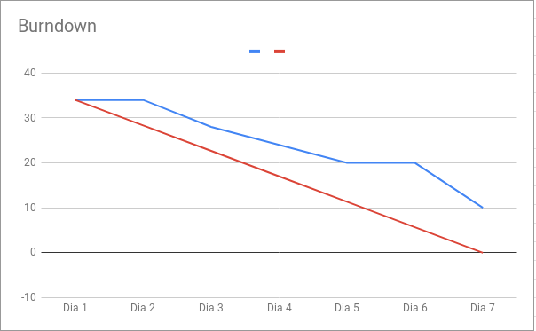
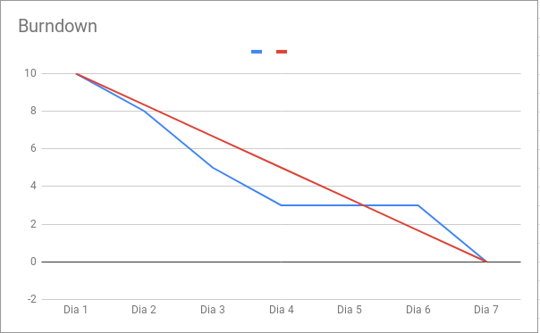
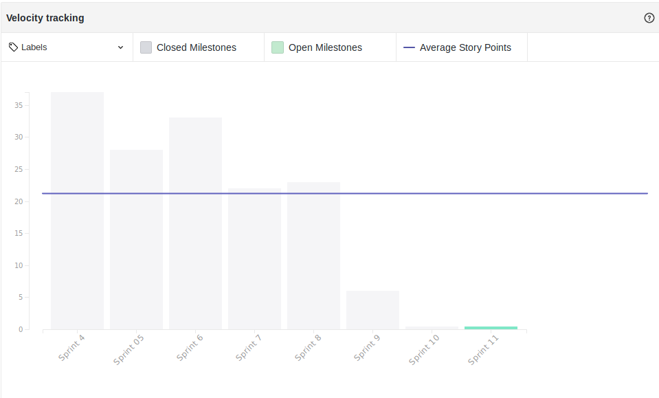
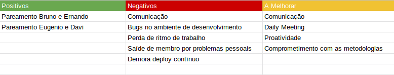

## Version control

|Date|Version|Update|Author|
|:--:|:----:|:-------:|:---:|
| 07/05/2019 |0.1|Criação e desenvolvimento do documento|Thiago Ferreira|

# Fechamento da Sprint

## Sprint Backlog

### Issues da Sprint 9
|Issue|Pontos|Responsável|Status|
|:---:|:----:|:---------:|:--------:|
| Criação de Plano de gerência de qualidade | 5 | Thiago Ferreira e Gabriel Ziegler |Icebox|
| US22 - Integração ao Kaggle| 5 | Ernando e Bruno|Não Entregue|
| US22 - Integração ao TowardsDataScience/Medium | 5 | Carlos e Alex |Não Entregue|
| US23 - Cross Valited |5|João Victor e Bruno|Entregue|
|Análise e adições ao backlog|3|Davi Alves|Icebox|
|Testes de Usabilidade e UX na aplicação|5|Davi e Eugenio|Não Entregue|
|Analisar os testes no bot para levantamento de qualidade|2|Entregue|
|Criação de código de conduta para o repo de código|1|Thiago Ferreira|Entregue|
|Criação de guia de contribuição para o repo de código|1|Thiago Ferreira|Entregue|
|Criação de templates para o repo de código|1|Thiago Ferreira|Entregue|
|Adicionar Kaggle ao Docker|1|Thiago Ferreira|Entregue|
| DEB - Deploy dos micro serviços em AWS | 8 | Thiago Ferreira & Eugênio |Não Entregue|
| DEB - Integrar API StackOverflow | 5 | Carlos Aragon & Ernando |Não Entregue|

### Issues da Sprint 10
|Issue|Pontos|Responsável|Status|
|:---:|:----:|:---------:|:--------:|
|Realização de testes em fluxos de conversa #1|1|Bruno|Entregue|
|Realização de testes em fluxos de conversa #2|1|Bruno|Entregue|
|Realização de testes em fluxos de conversa #3|1|Ernando|Entregue|
|Realização de testes em fluxos de conversa #4|1|Eugenio e Bruno|Entregue|
|Realização de testes em fluxos de conversa #5|1|Ernando|Entregue|
|Atualizar documento de processo de software com mudanças|0|Ziegler|Icebox|
|Refatoração e aperfeiçoamento dos fluxos de conversa #1|1|Bruno|Entregue|
|Refatoração e aperfeiçoamento dos fluxos de conversa #2|1|Bruno|Entregue|
|Refatoração e aperfeiçoamento dos fluxos de conversa #3|1|Ernando|Entregue|
|Refatoração e aperfeiçoamento dos fluxos de conversa #4|1|Bruno e Eugenio|Entregue|
|Refatoração e aperfeiçoamento dos fluxos de conversa #5|1|Ernando|Entregue|

**Pontos Planejados:**  57 
**Pontos Concluídos:**  21 
**Pontos Concluidos com debito: 21** 

### Legenda

- DEB: Débito de sprint passada.

### MVPs da Sprint

<!-- <table>
  </tr>
  <td align="center">
    <a href="https://github.com/Mexazonic">
       <b>Bruno Duarte</b></a> <a href="https://github.com/fga-eps-mds/2019.1-PyLearner/commits?author=Mexazonic" title="MVP">📖
    </a>
  </td>
  <td align="center">
    <a href="https://github.com/alexportof">
       <b>Álex Porto</b></a> <a href="https://github.com/fga-eps-mds/2019.1-PyLearner/commits?author=alexportof" title="MVP">📖
    </a>
  </td>
  <td align="center"><a href="https://github.com/joao15victor08"> <b>Joao Victor </b></a> <a href="https://github.com/fga-eps-mds/2019.1-PyLearner/commits?author=joao15victor08" title="Documentation">📖</a>
  </td>
  <tr>
  
</table> -->

# Burndown
## Sprint 9

## Sprint 10

# Velocity

- Análise: 
# Retrospectiva

## Presença na Reunião

* <b>Bruno      </b> : presente
* <b>Eugênio    </b> : presente
* <b>Ernando    </b> : presente
* <b>João Victor</b> : não presente
* <b>Carlos     </b> : presente
* <b>Davi       </b> : presente
* <b>Ziegler    </b> : presente
* <b>Thiago     </b> : presente
* <b>Total      </b> : presente

O membro de MDS, João Victor, não compareceu a reunião da sprint por motivos de saúde.

## Presença Dailies Presenciais

## Sprint 9
| Nome    |Segunda Feira|Terça Feira|Quarta Feira| Quinta Feira| Sexta Feira|
|:-----:  |:-----------------:|:----------------:|:----------------:|:-----------------:|:----------------:|
|Alex       |✘|✔|✘|✘|✘|
|Bruno      |✘|✔|✘|✘|✘|
|Eugênio    |✔|✘|✘|✘|✘|
|Ernando    |✔|✘|✘|✘|✘|
|João Victor|✘|✘|✘|✔|✘|
|Carlos     |✘|✘|✔|✘|✘|
|Davi       |✔|✘|✔|✔|✘|
|Ziegler    |✘|✘|✘|✘|✘|
|Thiago     |✔|✔|✔|✔|✘|

## Sprint 10
| Nome    |Segunda Feira|Terça Feira|Quarta Feira| Quinta Feira| Sexta Feira|
|:-----:  |:-----------------:|:----------------:|:----------------:|:-----------------:|:----------------:|
|Bruno      |✘|✘|✘|✔|✘|
|Eugênio    |✘|✘|✘|✔|✘|
|Ernando    |✘|✘|✘|✔|✘|
|João Victor|✘|✘|✘|✘|✘|
|Carlos     |✘|✘|✘|✔|✘|
|Davi       |✔|✘|✔|✘|✘|
|Ziegler    |✘|✘|✘|✔|✘|
|Thiago     |✘|✘|✘|✔|✘|

### Porcentagem de presença

* <b>Bruno      </b> : 20%
* <b>Eugênio    </b> : 20%
* <b>Ernando    </b> : 20%
* <b>João Victor</b> : 10%
* <b>Carlos     </b> : 20%
* <b>Davi       </b> : 50%
* <b>Ziegler    </b> : 10%
* <b>Thiago     </b> : 50%
* <b>Total      </b> : 15%

# Equipe
**Equipe de Gerência:**  
* **Arquiteto:** [Davi Alves](https://github.com/davialvb)   
* **Tech Leader:** [Gabriel Ziegler](https://github.com/gabrielziegler3)  
* **Product Owner:** [Carlos Aragon](https://github.com/carlosaragon)  
* **Devops:** [Thiago Ferreira](https://github.com/thiagoiferreira)

**Equipe de Desenvolvimento:**  
- [Bruno Duarte](https://github.com/Mexazonic) 
- [Ernando Braga](https://github.com/ZarathosDeath) 
- [Eugenio Sales](https://github.com/Eugeniosales) 
- [João Victor](https://github.com/joao15victor08) 