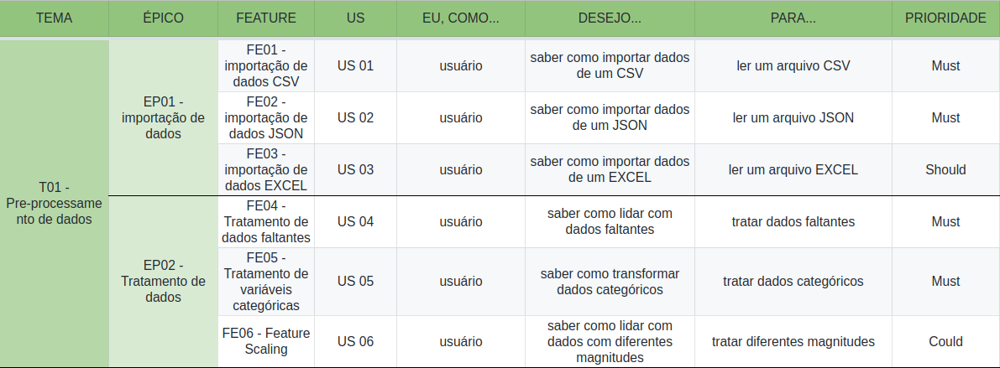
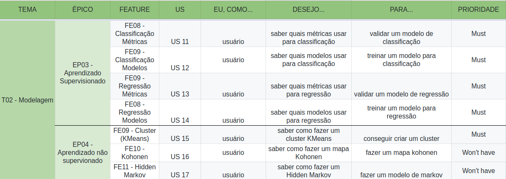
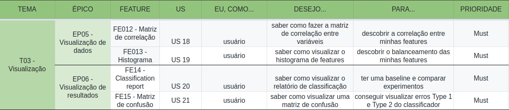
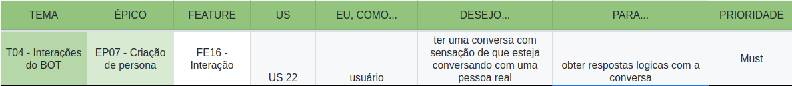

## Controle de versão

|Data|Versão|Alteração|Autor|
|:--:|:----:|:-------:|:---:|
|13/04/2019|0.1|Criação do documento|Gabriel Ziegler|
|13/04/2019|0.2|Definição da priorização|Gabriel Ziegler|
|13/04/2019|0.3|Definição dos temas e épicos|Gabriel Ziegler|
|13/04/2019|0.4|Adição das US com priorização|Gabriel Ziegler, Davi Alves|

## Técnica de priorização

A técnica utilizada para priorização de documentos foi o [MoSCoW](https://www.agilebusiness.org/content/moscow-prioritisation), que é fortemente utilizada para a priorização de requisitos de software.

A sigla MoSCoW significa:

* Must Have
* Should Have
* Could Have
* Won’t Have this time

## Temas e épicos

Os temas e épicos definidos para o PyLearner são:

* T01 Pré-processamento de dados.
    * EP - 1 Importação de dados
    * EP - 2 Tratamento de dados
* T02 Modelagem.
    * EP - 3 Aprendizado supervisionado
    * EP - 4 Aprendizado não-supervisionado
* T03 Visualização.
    * EP - 5 Visualização de dados
    * EP - 6 Visualização de resultados
* T04 Interações do BOT.
    * EP - 7 Criação de persona
* T05 Tutorial.
    * EP - 8 Iris Flower
    * EP - 9 MNIST
    * EP - 10 Titanic
* T06 Sugestões de conteúdo.
    * EP - 11 Espaços de conteúdos
    * EP - 12 Fórum

## Priorização

### Tema 1

### Tema 2

### Tema 3

### Tema 4

### Tema 5

### Tema 6

## Referencial

[1] https://www.agilebusiness.org/content/moscow-prioritisation
